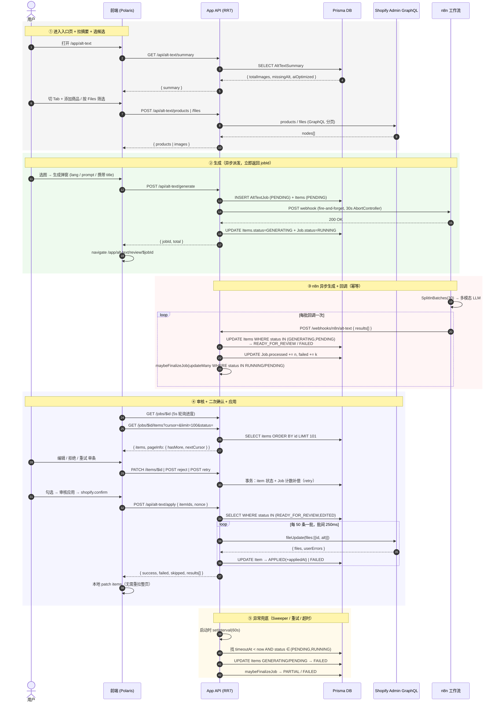
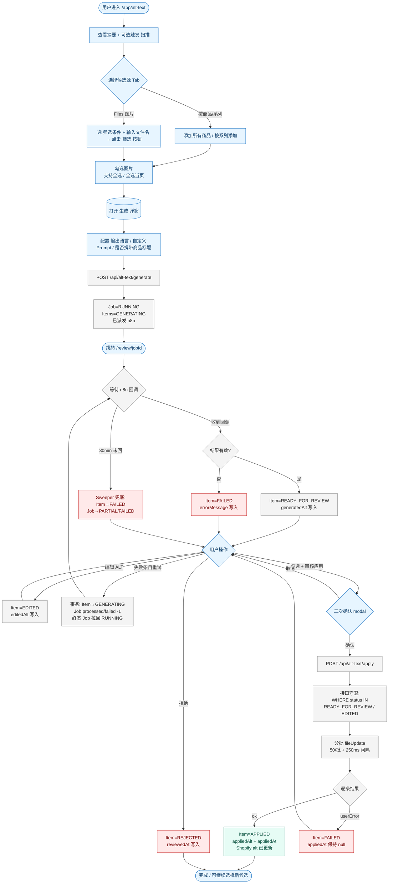

# AI 替代文本（Alt Text）功能技术方案

> 状态：v1.4（**与代码现状对齐**）
> 作者：Waterdrop App 团队
> 适用项目：`Waterdrop-Shopify-App`（React Router 7 + Shopify App + Polaris Web Components + Prisma）
> 关联截图：`docs/assets/alt-text-mockup-*.png`（参考竞品 UI）
> 部署形态：**内部店铺 App，无积分/计费体系**

## 变更记录

- **v1.4**：补齐与实现一致的若干细节：
  - 入口页结构：候选源由「并列卡片」升级为 **Tab 切换**（按商品/系列 ↔ Files 图片）；候选源不可同时存在，store 在 `setProducts/setFiles` 时互清。
  - 选区操作：原"全选/清空" 按钮替换为 **两个复选框**：「全选（当前 Tab 全部）」「全选当页」，支持 `indeterminate` 状态。
  - Files 视图：增加 **客户端分页（100/页）+ 文件名筛选 + 显式「筛选」按钮**（pendingFilter/pendingNameQuery 待提交模式，避免每次输入都触发服务端请求）。
  - 商品视图：客户端分页（50/页），单商品图片选择 modal 用 `nonce` 强制重新打开，监听 `close/hide/cancel` 事件保证 React state 同步。
  - 历史入口从主导航迁移为入口页右上「查看历史」按钮。
  - **修复 retry 接口的 Job 计数发散 bug**（详见 §9.3 与附录 D.1 已修缺陷 B1）。
  - **apply 接口失败分支不再误写 `appliedAt`**；`maybeFinalizeJob` 加 status 守卫防并发重复 finalize；n8n dispatch 加 30s 超时保护。
  - **审核页 (`/review/$jobId`) 改为 cursor 分页（100/页 + 加载更多）+ 状态筛选下拉**，操作（编辑/拒绝/重试/应用）改本地 patch，轮询只刷 `job` 进度，不再整页重拉（B5）。
  - 客户端 API 全面统一到 `~/utils/http` 的 `localApi: true` 模式，自动注入 App Bridge session token，解决 `shop: null` 问题。
  - **新增 §3.1 端到端数据流转时序图（mermaid sequenceDiagram）和 §3.2 业务流程图（mermaid flowchart）**，与代码现状一一对应，方便新成员快速建立全局认知。
  - **n8n webhook URL 从 env 收敛为代码常量** `N8N_PROD_WEBHOOK_URL`（位于 `app/config/altText.server.ts`），部署不再需要配 `N8N_ALT_WEBHOOK_URL`；env 仅作为调试 override 后门保留。
  - **OpenAI prompt 升级 + JSON 输出**：n8n 工作流 OpenAI 节点改为强制 `response_format: { type: 'json_object' }`，模型必须输出 `{"altText": "..."}`；system / user prompt 全面替换为更严谨的 SEO + 无障碍模板（详见 §6.5）。
  - **新增 `brand` / `keywords` 顶层字段**：n8n payload 新增两个字段（详见 §6.2），分别由 `BRAND_NAME` 代码常量 + 用户在生成弹窗输入的关键词（兜底 `STORE_DEFAULT_KEYWORDS`）填充，注入 user prompt 占位符。**`keywords` 持久化到 `AltTextJob.keywords`**（migration `alt_text_keywords`），保证 retry 沿用用户当时输入的关键词，而不是回退默认值。
  - **Format Result 节点改 `runOnceForAllItems` 模式 + 按 index 配对**：拿 `$input.all()`（OpenAI 响应数组）和 `$('Concurrency Limit (5)').all()`（源 dispatch items 数组）按下标一一对齐，**完全不依赖 pairedItem 元数据**，规避 v1.3 时 `pairedItem.item` 链路断引发的"全部 skip"问题；同时也修掉了 v1.4 中 HTTP Request v4.2 节点偶发不写 pairedItem，导致 `$('Concurrency Limit (5)').item` 在 Format Result 里返回 null、整个工作流"OpenAI 有响应但 Format Result 没 output"的问题。
- v1.2：n8n 鉴权（入口 token + 回调 HMAC）从 v1 移除，统一放到 v2 规划；调优类参数（batch size / 默认语言 / Job 超时）从 env 移到 `app/config/altText.server.ts` 代码常量。
- v1.1：移除积分相关全部设计；Files 入口明确支持「仅 ALT 为空」筛选；UI 部分明确统一使用 Shopify Polaris Web Components（与项目现有 `s-*` 组件保持一致）。

---

## 1. 背景与目标

为店铺内所有图片自动生成 AI 替代文本（Alt Text），提升 WCAG 2.1 / ADA / EN 301 549 的无障碍合规性与 SEO 表现。

### 核心目标

1. 支持**商品图**与**Shopify Files 中所有图片**（非商品图也能生成 Alt）。
2. 图片生成接口由 **n8n 工作流**对外暴露，App 仅负责编排、确认、写回。
3. AI 生成的 Alt 必须经过**用户二次确认（审核通过）**才会写回 Shopify，未审核默认不应用。
4. 用户可在「生成」前自定义提示词、输出语言、是否携带商品标题作为上下文。
5. 历史记录可二次编辑、可查看状态、可重新审核应用。

### 非目标（v1 不做）

- 多语言 Translatable Resource 翻译同步（v2）
- Bulk Operation 处理 5w+ 图片（v2 优化）
- 自动监听 `products/update` 实时生成（v2）

---

## 2. 用户场景与 UI 流程（基于参考截图）

### 2.1 入口页 `/app/alt-text`

```
┌──────────────────────────────────────────────────────────────────┐
│  AI 替代文本                                  [查看历史]          │
├──────────────────────────────────────────────────────────────────┤
│  [替代文本摘要]                                       [扫描]      │
│  4223 图片总数 │ 4000 缺 ALT │ 1 AI 优化  · 上次扫描 2026-04-27   │
├──────────────────────────────────────────────────────────────────┤
│  [按商品/系列]  [Files 图片]   ← 两个 button 模拟 Tab，互斥切换   │
├──────────────────────────────────────────────────────────────────┤
│  当 view=products：                                              │
│    [搜索商品] [添加所有商品] [按系列添加]                          │
│  当 view=files：                                                 │
│    筛选: [全部 / 仅 ALT 为空 / 仅 AI 优化 ▼]                     │
│    文件名: [输入片段...]                            [筛选]        │
├──────────────────────────────────────────────────────────────────┤
│  已选 N 张图片，来自 M 件商品 / Files 图片                        │
│  K 张已有 ALT — 跳过                                              │
│  ☐全选(All)  ☐全选当页  [生成 ALT (N)]                            │
├──────────────────────────────────────────────────────────────────┤
│  ▼ products 视图：表格（每页 50）                                 │
│  | 商品 | 总图片 | 已选 | 操作（选择图片 / 删除）|                │
│  ▼ files 视图：表格（每页 100，按文件名片段过滤）                 │
│  | ☐ | 图片 | 图片名称 | ALT |                                   │
│  分页：上一页 / 1-50 共 N / 下一页                                │
└──────────────────────────────────────────────────────────────────┘
```

#### 关键交互

- **扫描**：调 `POST /api/alt-text/scan`，同步遍历 Files 摘要并写回 `AltTextSummary`。
- **Tab 切换**：`view: 'products' | 'files'`。两套候选互斥，store 在 `setProducts`/`setFiles` 时清对侧并默认全选所有图片。
- **products 视图**：
  - **搜索商品** → `shopify.resourcePicker({ type: 'product', multiple: true })` → POST `/api/alt-text/products` `{source:'products', productIds}`。
  - **按系列添加** → `shopify.resourcePicker({ type: 'collection', multiple: true })` → POST `/api/alt-text/products` `{source:'collections', collectionIds}`，服务端展开为商品+图片。
  - **添加所有商品** → POST `/api/alt-text/products` `{source:'all-products'}`，服务端分页 GraphQL 拉全部。
  - 候选商品扁平表格，每商品有「选择图片」（弹 modal 看图片明细 + 行内 ALT）与「删除」操作；表格每页 50 条客户端分页。
- **files 视图**：
  - **筛选**（待提交模式）：`pendingFilter`/`pendingNameQuery` 仅更新本地 UI 状态，**点击「筛选」按钮**才提交：
    - 筛选模式变更或首次加载 → 调 `POST /api/alt-text/files`
    - 仅文件名片段变更 → 不发请求，仅做客户端 `includes` 过滤
  - 表格每页 100 条客户端分页；文件名从 CDN URL 提取（`getImageFilename`）。
- **选区 Banner**：
  - 「全选」复选框：作用于 **当前 Tab 的全部图片**（跨页），状态同步 `viewAllIds`。
  - 「全选当页」复选框：作用于 **当前页的图片**，与「全选」同时显示（互不互斥）。
  - 两个复选框都支持 `indeterminate`：部分选中时半勾。
- **跳过已有 ALT**：banner 内文字链接，把 `originalAlt !== ''` 的图片从选区移除。
- **生成 ALT**：打开 `GenerateModal`（语言/自定义 prompt/是否带商品标题），提交后调 `POST /api/alt-text/generate`。

### 2.2 商品 + 图片选择弹窗（截图 2）

点击单个商品的「选择图片」打开 Modal，**该商品的所有图片在第一次添加时就已经一次性返回**，弹窗只做本地勾选/反选：

```
[选择图片]                                 [×]
☑ 11 selected
┌─────────────────────────────────────┐
│ ☑ [thumb] 原 ALT: 无                │
│ ☑ [thumb] 原 ALT: 无                │
│ ☑ [thumb] 原 ALT: ...               │
└─────────────────────────────────────┘
                                   [完成]
```

> 设计要点：**商品列表与图片明细必须一次 GraphQL 拉回**（避免点开弹窗再次请求带来的卡顿与限流）。前端用 zustand 缓存 `products[].images[]`，弹窗只是过滤/勾选。

### 2.3 生成弹窗（截图 3）

点击右上「生成」打开 Modal：

```
[生成 AI 替代文本]                       [×]
SUMMARY
将处理 3159 张图片
┌────────────────────────────────────┐
│ IMAGES 3159 (will be updated)      │
└────────────────────────────────────┘
Output language     [English ▼]
☑ 默认携带商品标题作为上下文
[+ 自定义提示词（高级）]
  ┌──────────────────────────────────┐
  │ You are an SEO expert. Generate  │
  │ ≤ 125 chars, no "image of"...    │
  └──────────────────────────────────┘
ⓘ 生成时间取决于队列长度，生成后需要审核才会生效
                    [生成]   [取消]
```

#### 字段

| 字段                  | 类型  | 说明                                                |
| --------------------- | ----- | --------------------------------------------------- |
| `language`            | enum  | 英/中/德/法/日 等，下拉。默认取店铺主语言。         |
| `includeProductTitle` | bool  | 默认 true。商品图时把 `product.title` 注入 prompt。 |
| `promptOverride`      | text? | 留空使用系统默认 prompt 模板。                      |

### 2.4 历史记录页（截图 4）`/app/alt-text/history`

```
[搜索商品] [按系列添加] [添加所有商品]  [↶ 返回选择]
[全部] [已完成] [排队中] [生成中] [失败]   [⟳ 刷新]
┌──────────────────────────────────────────────────┐
│ 图片  状态        替代文本             更新时间 操作│
│ [□] COMPLETED   Waterdrop WD-DA29...   4d ago [✎] │
│ [□] PENDING_REVIEW  Waterdrop ...      now    [✎] │
└──────────────────────────────────────────────────┘
                         [批量审核应用 N 项]
```

#### 二次审核与编辑流程

1. 状态为 `READY_FOR_REVIEW` / `EDITED`（用户改过）的条目，**可勾选 + 批量"审核应用"**。
2. 点击 `✎` 弹出编辑抽屉：可修改 Alt、保存（变 `EDITED`）。**保存 ≠ 应用**。
3. 已 `APPLIED` 的条目仍可二次编辑，编辑后状态回到 `EDITED`，需要再次审核应用。
4. 状态机详见 §4.2。

> **强约束**：未审核（即未走过"审核应用"按钮 + Modal 二次确认）的 Alt **不会**被写到 Shopify。后端在 `apply` 接口里强制校验 `status in (READY_FOR_REVIEW, EDITED)` 才允许写。

---

## 3. 系统架构

```
┌──────────────────────────────────────────────────┐
│  Shopify Admin (iframe)                          │
│   /app/alt-text  /history  /review/:jobId        │
│   - Polaris Web Components + AppBridge           │
│   - Resource Picker / Modal / Toast              │
└──────────────────┬───────────────────────────────┘
                   │ sessionToken (idToken)
                   ▼
┌──────────────────────────────────────────────────┐
│  Waterdrop-Shopify-App (React Router 7 / Node)   │
│  Routes:                                         │
│    /api/alt-text/summary                         │
│    /api/alt-text/scan                            │
│    /api/alt-text/products    (search/all/by-col) │
│    /api/alt-text/files                           │
│    /api/alt-text/jobs/$id                        │
│    /api/alt-text/jobs/$id/items                  │
│    /api/alt-text/generate                        │
│    /api/alt-text/items/$id   (PATCH 编辑)        │
│    /api/alt-text/apply                           │
│    /webhooks/n8n/alt-text    (v1 无鉴权)         │
│  Services:                                       │
│    services/altText.server.ts                    │
│    services/n8n.server.ts                        │
│  DB: Prisma → SQLite/PostgreSQL                  │
└──────┬───────────────────────────┬───────────────┘
       │ Admin GraphQL              │ HTTP
       ▼                            ▼
┌────────────────────┐   ┌──────────────────────────┐
│  Shopify Admin API │   │  n8n 工作流 (异步 + 回调)│
│  files / products  │   │  - 多模态 LLM            │
│  fileUpdate        │   │  - SplitInBatches        │
└────────────────────┘   └──────────────────────────┘
```

### 关键设计决策

| 决策             | 选择                          | 原因                                |
| ---------------- | ----------------------------- | ----------------------------------- |
| Alt 写回方式     | 统一 `fileUpdate(MediaImage)` | 商品图与 Files 图同源，避免双套逻辑 |
| 生成调用模式     | 异步派发 + n8n 回调           | 大量图（千级）时同步会超时          |
| 二次确认强制     | DB 状态机 + `apply` 接口校验  | 防止被前端绕过                      |
| 商品图与图片明细 | 一次 GraphQL 全量拉回         | 弹窗即开即用，减少请求              |
| 任务粒度         | Job + Item 两级               | 支持单条重试、按图回调              |

### 3.1 端到端数据流转时序图

> 下图覆盖完整生命周期：候选选择 → 生成派发 → n8n 回调 → 审核 → 应用 → 异常兜底。**每条箭头都是真实代码可追溯的接口调用**（参见 §7 路由表）。



### 3.2 业务流程图

> 从用户视角看完整状态分支与决策点。**圆角节点 = 用户动作，矩形 = 系统状态/动作，菱形 = 分支判断**。和 §4.2 状态机互为表里：状态机刻画"item 状态如何转移"，本图刻画"为了让 item 走完一遍状态机用户和系统各做了什么"。



> **图例阅读建议**
>
> - 蓝色（用户动作）：所有需要用户在 UI 主动点击 / 输入的节点；
> - 绿色（成功终点）：写回 Shopify 成功后的最终态；
> - 红色（异常态）：所有 FAILED / REJECTED / 兜底分支，**都不会写 `appliedAt`**（v1.4 修正），方便后续审计区分"真实应用"和"应用失败"。
> - `Retry → Wait` 是闭环：重试一条会"放回"等待 n8n 回调的轨道。

---

## 4. 数据模型（Prisma）

### 4.1 Schema 现状

> ⚠️ 项目当前 `provider = "sqlite"`，**SQLite 不支持原生 enum**。所有"枚举"字段统一用 `String` 存储，取值约束放在应用层（`app/types/altText.ts` 中的 `JOB_TYPES / JOB_STATUSES / ITEM_STATUSES / RESOURCE_TYPES / FILES_FILTERS` 常量数组 + 类型 guards）。如未来切到 Postgres 可平滑迁移到原生 `enum`。

`prisma/schema.prisma` 实际：

```prisma
model AltTextJob {
  id                  String        @id @default(cuid())
  shop                String
  type                String        // SCAN | GENERATE | APPLY
  status              String        @default("PENDING") // PENDING | RUNNING | SUCCEEDED | PARTIAL | FAILED | CANCELLED
  source              String        // products | collections | all-products | files-all | files-missing-alt | files-ai-optimized
  filter              String?       // JSON 字符串：选中的商品 ID / 系列 ID / Files 筛选
  language            String        @default("en")
  prompt              String?
  keywords            String?       // ← v1.4 新增：用户在生成弹窗输入的本批 SEO 关键词；retry 时复用
  includeProductTitle Boolean       @default(true)
  total               Int           @default(0)
  processed           Int           @default(0)
  failed              Int           @default(0)
  createdBy           String?
  errorMessage        String?
  timeoutAt           DateTime?     // ← 新增，sweeper 用
  createdAt           DateTime      @default(now())
  updatedAt           DateTime      @updatedAt
  items               AltTextItem[]

  @@index([shop, status])
  @@index([shop, createdAt])
}

model AltTextItem {
  id              String     @id @default(cuid())
  jobId           String
  job             AltTextJob @relation(fields: [jobId], references: [id], onDelete: Cascade)
  shop            String
  resourceType    String     // PRODUCT_IMAGE | FILE_MEDIA_IMAGE | FILE_GENERIC
  resourceId      String     // gid://shopify/MediaImage/xxx
  parentId        String?    // gid://shopify/Product/xxx（仅商品图）
  parentTitle     String?
  imageUrl        String
  thumbnailUrl    String?
  originalAlt     String?
  generatedAlt    String?
  editedAlt       String?
  appliedAlt      String?    // 仅 APPLIED 时写入；FAILED 不写
  status          String     @default("PENDING") // PENDING | GENERATING | READY_FOR_REVIEW | EDITED | APPLIED | REJECTED | FAILED
  errorMessage    String?
  language        String?
  n8nExecutionId  String?
  generatedAt     DateTime?
  reviewedAt      DateTime?
  appliedAt       DateTime?  // 仅 APPLIED 时写入；FAILED 不写
  createdAt       DateTime   @default(now())
  updatedAt       DateTime   @updatedAt

  @@unique([shop, resourceId, jobId])
  @@index([shop, status])
  @@index([jobId, status])
  @@index([shop, resourceId])
}

model AltTextSummary {
  shop        String    @id
  totalImages Int       @default(0)
  missingAlt  Int       @default(0)
  aiOptimized Int       @default(0)
  lastScanAt  DateTime?
  updatedAt   DateTime  @updatedAt
}
```

#### 字段语义注意点

- `appliedAt`：**仅在 fileUpdate 真正成功（status → APPLIED）时写入**。任何分支的 FAILED（包括"无可写 alt"、整批网络错误、单条 userError）都 **不更新 appliedAt**。
- `reviewedAt`：用户在 review 页主动拒绝（REJECTED）或 apply 成功（APPLIED）时写。
- `generatedAt`：n8n 回调成功（READY_FOR_REVIEW）或失败（FAILED 但有回调结果）时写。
- `@@unique([shop, resourceId, jobId])`：允许同一资源在不同 Job 中重复生成（迭代优化），同 Job 内由上层去重 + 该约束兜底。

> **说明**：本 App 为内部店铺使用，不接 Shopify Billing API、不做积分/计费体系，因此无 `ShopCredits` 表，生成接口也无需做余额校验。

#### `JOB_TYPES` 当前实现现状

- `'GENERATE'`：通过 `createGenerateJob` 创建，是当前主流程。
- `'SCAN'`：保留枚举值；`POST /api/alt-text/scan` v1 是同步（直接写 `AltTextSummary`）不落 Job，预留 v2 大店改异步时使用。
- `'APPLY'`：保留枚举值；v1 apply 操作不创建独立 Job（成功失败直接落到 item 状态 + apply 接口日志）。如未来需要审计 apply 历史可启用此类型。

### 4.2 状态机

```
       创建 Job
          │
          ▼
       PENDING ──(派发 n8n)──▶ GENERATING
                                   │
                ┌──────────────────┼──────────────────┐
                ▼                  ▼                  ▼
            FAILED       READY_FOR_REVIEW       (n8n error)
                                   │
                  ┌────────────────┼────────────────┐
                  ▼                ▼                ▼
              REJECTED         EDITED         (审核应用)
                                   │                │
                              （审核应用）           ▼
                                   │            APPLIED
                                   ▼
                                APPLIED
```

- `editedAlt != null` → 后续用 `editedAlt` 写回；否则用 `generatedAlt`。
- `apply` 接口内部 `WHERE status IN ('READY_FOR_REVIEW', 'EDITED')`，保证未审核不应用。
- `APPLIED` 后再次编辑，状态回到 `EDITED`，下次需要重新走 `apply`。

### 4.3 迁移命令

```bash
pnpm prisma migrate dev --name add_alt_text
pnpm prisma generate
```

---

## 5. Shopify GraphQL 接入

### 5.1 拉取摘要（扫描）

使用 `files` 与 `products` 的总数和缺 ALT 数。轻量摘要可用 `query` 过滤：

```graphql
query AltTextSummary {
  totalFiles: files(first: 1, query: "media_type:IMAGE") {
    nodes {
      id
    }
    pageInfo {
      hasNextPage
    }
  }
  # 注意：files 没有 totalCount，需要用 BulkOperation 或迭代统计
}
```

> ⚠️ Shopify Files API **没有 `totalCount`** 字段。生产实现里走 `BulkOperationRunQuery` 一次性拉全量到 JSONL，再入库统计。详见 §10。

### 5.2 一次拉商品 + 全部图片（截图 1 数据格式）

对应「添加所有商品」/「按系列添加」：

```graphql
query ProductsWithImages($cursor: String, $query: String) {
  products(first: 50, after: $cursor, query: $query) {
    pageInfo {
      hasNextPage
      endCursor
    }
    nodes {
      id
      title
      handle
      featuredMedia {
        ... on MediaImage {
          id
          alt
          image {
            url
          }
        }
      }
      media(first: 100, query: "media_type:IMAGE") {
        nodes {
          ... on MediaImage {
            id
            alt
            image {
              url
              width
              height
            }
          }
        }
      }
    }
  }
}
```

返回结构示例（落到前端 store 与后端 Job 时的中间态）：

```ts
interface ProductWithImages {
  id: string
  title: string
  totalImages: number
  imagesWithAlt: number
  images: Array<{
    id: string // gid://shopify/MediaImage/...
    url: string
    alt: string | null
    selected: boolean // 前端默认全选
  }>
}
```

### 5.3 拉取 Files 库中所有图片（满足需求 2）

支持三种筛选模式：`all` / `missing-alt`（**默认且最高频**）/ `ai-optimized`。

#### 5.3.1 GraphQL 查询

```graphql
# 通用查询
query AllFiles($cursor: String, $query: String!) {
  files(first: 100, after: $cursor, query: $query) {
    pageInfo {
      hasNextPage
      endCursor
    }
    nodes {
      __typename
      ... on MediaImage {
        id
        alt
        image {
          url
          width
          height
        }
        fileStatus
        createdAt
      }
      ... on GenericFile {
        id
        alt
        url
        mimeType
        createdAt
      }
    }
  }
}
```

#### 5.3.2 三种筛选模式的实现

| `filter`       | Shopify `query`    | 二次过滤（服务端）                                            |
| -------------- | ------------------ | ------------------------------------------------------------- |
| `all`          | `media_type:IMAGE` | 仅保留 `MediaImage` 与 `GenericFile.mimeType=image/*`         |
| `missing-alt`  | `media_type:IMAGE` | **追加 `alt == null \|\| alt.trim() === ''`**                 |
| `ai-optimized` | `media_type:IMAGE` | 与本地 `AltTextItem WHERE shop=? AND status='APPLIED'` 取交集 |

> ⚠️ **关键说明**：Shopify Files API 的 `query` 参数对 `alt:''` / `alt:null` 的支持**不稳定**（不同版本行为不同）。**正确做法是只用 `media_type:IMAGE` 过滤，再在服务端做 `alt` 为空判断**，保证结果可靠。该判断已封装在 `services/altText.server.ts#scanFilesByFilter`。

#### 5.3.3 「仅 ALT 为空」服务端实现示意

```ts
// app/services/altText.server.ts
export async function scanFilesByFilter(
  admin: AdminApiContext['admin'],
  filter: 'all' | 'missing-alt' | 'ai-optimized'
): Promise<ScannedImage[]> {
  const out: ScannedImage[] = []
  let cursor: string | null = null

  do {
    const res = await admin.graphql(ALL_FILES_QUERY, {
      variables: { cursor, query: 'media_type:IMAGE' }
    })
    const data = (await res.json()).data.files

    for (const n of data.nodes) {
      const isImage =
        n.__typename === 'MediaImage' || (n.__typename === 'GenericFile' && n.mimeType?.startsWith('image/'))
      if (!isImage) continue

      // 关键：服务端做 alt 为空判断，避免依赖 Shopify query 语法
      if (filter === 'missing-alt') {
        const alt = (n.alt ?? '').trim()
        if (alt !== '') continue
      }

      out.push({
        resourceType: n.__typename === 'MediaImage' ? 'FILE_MEDIA_IMAGE' : 'FILE_GENERIC',
        resourceId: n.id,
        imageUrl: n.__typename === 'MediaImage' ? n.image?.url : n.url,
        alt: n.alt ?? null
      })
    }

    cursor = data.pageInfo.hasNextPage ? data.pageInfo.endCursor : null
  } while (cursor)

  // ai-optimized 单独走一次本地反查
  if (filter === 'ai-optimized') {
    const appliedIds = new Set(
      (
        await prisma.altTextItem.findMany({
          where: { shop, status: 'APPLIED' },
          select: { resourceId: true }
        })
      ).map((i) => i.resourceId)
    )
    return out.filter((i) => appliedIds.has(i.resourceId))
  }

  return out
}
```

### 5.4 批量写回 Alt（只在 apply 接口调用）

```graphql
mutation FileUpdate($files: [FileUpdateInput!]!) {
  fileUpdate(files: $files) {
    files {
      id
      alt
    }
    userErrors {
      field
      message
      code
    }
  }
}
```

每次最多 50 张，分批 + 限流（见 §9）。

### 5.5 Scopes 调整

`shopify.app.toml` 修改：

```diff
- scopes = "read_customers,write_customers,write_files,read_discounts,write_discounts,read_gift_cards,write_gift_cards,read_products"
+ scopes = "read_customers,write_customers,read_files,write_files,read_discounts,write_discounts,read_gift_cards,write_gift_cards,read_products"
```

只增加 `read_files`。`write_products` 不需要（统一走 `fileUpdate`）。

---

## 6. n8n 工作流接入

### 6.1 调用方向：异步派发 + 回调

```
Waterdrop App ──POST──▶ n8n Webhook
                          │
                  SplitInBatches (并发 5)
                          │
                   多模态 LLM 节点（OpenAI / Claude / Qwen-VL）
                          │
                  Set / Code 整理结构
                          │
              ◀──POST──── HTTP Request 回调本 App
```

### 6.2 App → n8n 请求

> **v1 不做鉴权**（内部部署网络隔离即可）；v2 再补 `X-Auth-Token` 与回调 HMAC（详见 §15）。

```http
POST {N8N_ALT_WEBHOOK_URL}
Content-Type: application/json

{
  "jobId": "ck...",
  "shop": "waterdropde.myshopify.com",
  "callbackUrl": "https://shopify.waterdropfilter.com/webhooks/n8n/alt-text",
  "language": "en",
  "promptOverride": null,
  "includeProductTitle": true,
  "brand": "Waterdrop",
  "keywords": "water filter, reverse osmosis, RO, under-sink, countertop water filter, faucet",
  "items": [
    {
      "itemId": "ck...",
      "imageUrl": "https://cdn.shopify.com/.../foo.jpg",
      "context": {
        "resourceType": "PRODUCT_IMAGE",
        "productTitle": "Waterdrop G3P800 RO 净水器"
      }
    }
  ]
}
```

字段说明：

- `promptOverride`：用户在生成弹窗自定义的 system prompt；为 null 时 n8n 走 §6.5 内置默认模板。
- `includeProductTitle = false` 时，`context.productTitle` 不下发，n8n 不拼接到 prompt。
- `brand`（v1.4 新增）：店铺品牌名，由 `app/config/altText.server.ts::BRAND_NAME` 注入；填进 user prompt 的 `Brand` 占位符。
- `keywords`（v1.4 新增）：本批 SEO 关键词，由用户在生成弹窗输入；为空则后端用 `STORE_DEFAULT_KEYWORDS` 兜底；填进 user prompt 的 `Keywords` 占位符。
- 单次最多 30 个 item；超过则 App 端切批多次 POST（`ALT_TEXT_BATCH_SIZE` 常量）。

### 6.3 n8n → App 回调

```http
POST /webhooks/n8n/alt-text
Content-Type: application/json

{
  "jobId": "ck...",
  "results": [
    { "itemId": "ck1", "status": "ok",    "altText": "...", "executionId": "n8n-exec-1" },
    { "itemId": "ck2", "status": "error", "errorMessage": "image inaccessible" }
  ]
}
```

回调处理：

1. v1 不做签名校验，仅按 `jobId` 找到 Job 后处理。v2 加 HMAC（`crypto.timingSafeEqual`）。
2. 仅处理 `results` 数组中出现的条目；**若某张图既没有出现在 results，也没有任何条目层面的 FAILED**，则可能仍在 `GENERATING`，依赖超时 sweeper 或用审核页的「批量重试失败」处理。
3. 事务内更新 `AltTextItem.status` 与 `AltTextJob.processed/failed`。
4. 全部完成时，更新 `Job.status = SUCCEEDED / PARTIAL / FAILED`。
5. 推送前端：v1 用前端轮询 `/api/alt-text/jobs/$id`（5s）；v2 升级 SSE。
6. **批量重试**：review 页提供「批量重试失败」按钮 → `POST /api/alt-text/jobs/:id/retry-failed`。后端找该 Job 全部 `FAILED` items，事务把它们撤回 `GENERATING + 清错 + Job.processed/failed -= len + 终态 Job 拉回 RUNNING`，按 `ALT_TEXT_BATCH_SIZE` 切批 dispatch。任一 batch dispatch 失败仅回滚该 batch 的 items 与计数。

### 6.4 开箱即用工作流文件

> 完整的 n8n 工作流定义放在 [`docs/n8n/waterdrop-alt-text.workflow.json`](./n8n/waterdrop-alt-text.workflow.json)，配套部署说明见 [`docs/n8n/README.md`](./n8n/README.md)。导入 → 配 OpenAI 凭证 → 激活即可。
>
> 工作流默认用 `gpt-5.5` 多模态接口；图片**只传 URL**（OpenAI 服务端自己抓 Shopify CDN），**无下载/编码节点**，链路最短。
>
> v1.4 起 webhook 生产 URL 已固化在 `app/config/altText.server.ts::N8N_PROD_WEBHOOK_URL`，**无需配 env**；只在调测试模式 webhook 时用 `.env.local::N8N_ALT_WEBHOOK_URL` 临时 override。

### 6.5 默认 Prompt 模板（n8n 内置 + 可被覆盖）

> v1.4 起 OpenAI 节点强制 `response_format: { type: "json_object" }`，模型必须返回 `{"itemId": "...", "altText": "..."}`，由 Format Result 节点解析。下面分 system / user 两段。
>
> **设计原则（v1.4.1）— "控制流上下文 vs 数据上下文"完全解耦**：
>
> - **system message** 只放行为规则；用户填写的 `promptOverride` 会**完整覆盖** system，但绝对覆盖不到 user。
> - **user message** 永远是固定结构 = `Input data`（结构化字段，含 `itemId`）+ `Task`（生成 alt 任务说明）+ `JSON output schema`，**不受 promptOverride 影响**。
> - **OpenAI response 自带 `itemId`**：让模型把输入的 `itemId` 原样回写（system rule 18 + user prompt 的 schema 约束），下游 Format Result 即可拿到完整链路数据，不再依赖 n8n 的 pairedItem 元数据。

#### System Prompt（`promptOverride` 为空时使用）

```
You are an expert ecommerce SEO and accessibility copywriter for Shopify websites.
Your task is to generate accurate, natural, and SEO-friendly English alt text for website images based only on the image content and page context.
The images may include product photos, lifestyle scenes, usage scenarios, installation images, detail images, comparison images, banners, blog images, icons, or decorative visuals.
Follow these rules strictly:
1. Describe what is actually visible in the image.
2. Make the alt text helpful for users who cannot see the image.
3. Write in natural English, not as a list of keywords.
4. Keep the alt text concise, ideally 80–125 characters.
5. Do not exceed 125 characters unless necessary to clearly describe important visual information.
6. Do not use keyword stuffing.
7. Do not invent product features, certifications, benefits, or performance claims.
8. Do not mention claims such as "removes 99%," "NSF certified," "best," "healthy," "safe," "eco-friendly," or "top-rated" unless the claim is clearly visible in the image.
9. Do not start with "Image of," "Photo of," "Picture of," or similar phrases.
10. If a product is clearly visible, include the product type, visible feature, usage scenario, or location.
11. If the image mainly shows a lifestyle or usage scene, describe the scene naturally without forcing a product name.
12. If the image is a banner or hero image, describe the main visual subject and setting.
13. If the image is an infographic, describe the main message or visible information in a concise way.
14. If the image is purely decorative and does not add meaningful information, return an empty alt text.
15. If the image contains readable text that is important to understanding the image, include the key message.
16. If the image is ambiguous, describe it cautiously and only mention what can be visually confirmed.
17. The alt text MUST be written in the language specified by the user prompt's "Output language" field.
18. Echo back the input itemId verbatim in the "itemId" field of your JSON output. Never invent, modify, omit, or rename it.
19. Output only valid JSON in the schema specified by the user prompt. Do not include explanations outside the JSON.
```

> 注：原 system prompt 第 3 条 "Write in natural English" 已改为 "Write in natural language"，与新增的 17 号规则配合多语种输出。规则 18 是 v1.4.1 新增的链路数据回写约束。

#### User Prompt（每张图片独立渲染，固定结构，**不受 promptOverride 影响**）

```
Input data:
itemId: {{ itemId }}                                  ← item.itemId（cuid，让模型原样回写实现链路追踪）
Output language: {{ language }}                       ← payload.language（en / zh-CN / fr / ...）
Product title, if available: {{ product_title }}     ← includeProductTitle && context.productTitle 否则 'N/A'
Brand, if available: {{ brand }}                      ← payload.brand 或 'N/A'
Keywords: {{ keywords }}                              ← payload.keywords 或 'N/A'
Image URL: {{ image_url }}                            ← item.imageUrl（同时随 image_url 多模态项一起传给模型）

Task:
Generate one accurate alt text for the image based only on the visible image content and the input data above. Follow the rules in the system prompt strictly.

JSON output schema (output exactly this shape, nothing else):
{
  "itemId": "<copy the input itemId above verbatim>",
  "altText": "<your generated alt text, or empty string if the image is purely decorative>"
}
```

> 占位符注入规则：
>
> - `itemId`：来自 `item.itemId`（cuid 字符串），让模型原样回写以**自带链路标识**；下游 Format Result 仍以 source 的 itemId 为权威，echoed 仅作可观测性校验。
> - `Output language`：来自 `payload.language`，留空兜底 `'en'`。
> - `Product title`：仅当 `payload.includeProductTitle === true` 且 `item.context.productTitle` 非空时才注入，否则填 `'N/A'`（尊重生成弹窗"将商品标题作为上下文一并发送"开关）。
> - `Brand` / `Keywords`：来自 `payload.brand` / `payload.keywords`，空串兜底 `'N/A'`。
> - `Image URL`：同 `item.imageUrl`，与 `image_url` 多模态项内容一致；写入 prompt 文本作排障线索。
>
> 注意：v1.4.1 起 user prompt 不再重复 system prompt 的规则段（规则统一在 system 里维护，避免 token 重复 / 行为分裂）；仅保留 **Input + Task + Schema** 三段固定结构。

#### 输出处理（Format Result 节点）

- **执行模式：`runOnceForAllItems`**。一次性拿到当前 batch 的全部 OpenAI 响应（`$input.all()`）和源 dispatch items（`$('Concurrency Limit (5)').all()`），按 index 对齐配对。**不依赖 pairedItem 元数据**——n8n HTTP Request v4.2 节点不一定向下游写 pairedItem，若 Format Result 用 `runOnceForEachItem + $('xxx').item` 取源 item，会偶发取空 → 整条 `return null` → 工作流"OpenAI 有响应但 Format Result 没 output"。
- 解析 `choices[0].message.content` 的 JSON 取 `itemId` / `altText` 字段。
- **itemId 双校验**：source by index 是权威；模型回写的 `parsed.itemId` 仅作可观测性 log，不一致打 `console.warn`，便于在 OpenAI 端按 itemId 排障，但不影响业务结果。
- **空 `altText`**（按规则 14，模型判定为装饰图）→ 当前 v1 映射为 `status: 'error'`，`errorMessage: 'Decorative image or empty altText returned by model'`，让用户在 review 页人工决定。**v2 可考虑允许空 alt 落库 + apply 时跳过 fileUpdate**（空 alt 在无障碍语义上是合法的，告诉屏幕阅读器忽略此图）。
- 长度兜底：> 125 字符再前端截断。

---

## 7. 后端路由清单

> 全部基于已有的 `app/pages/api/*.tsx` 文件路由约定。Webhook 路由放在 `app/pages/webhooks/n8n/alt-text.tsx`。

### 7.1 路由表（与代码现状对齐）

| 方法  | 路径                                  | 鉴权     | 说明                                                                                                                                                                 |
| ----- | ------------------------------------- | -------- | -------------------------------------------------------------------------------------------------------------------------------------------------------------------- |
| GET   | `/api/alt-text/summary`               | session  | 读 `AltTextSummary` 表，不触发扫描                                                                                                                                   |
| POST  | `/api/alt-text/scan`                  | session  | **同步**遍历 Files 计算并写回摘要（v1 简化）                                                                                                                         |
| POST  | `/api/alt-text/products`              | session  | body: `{ source: 'all-products' \| 'products' \| 'collections', productIds?, collectionIds? }`                                                                       |
| POST  | `/api/alt-text/files`                 | session  | body: `{ filter: 'all' \| 'missing-alt' \| 'ai-optimized' }`，**全量返回**（无 cursor）                                                                              |
| GET   | `/api/alt-text/jobs`                  | session  | 历史列表，query: `status`、`cursor`、`limit`（默认 20，上限 100），id 游标分页                                                                                       |
| GET   | `/api/alt-text/jobs/$id`              | session  | Job 进度（轮询，间隔 5s 直到终态）                                                                                                                                   |
| GET   | `/api/alt-text/jobs/$id/items`        | session  | 分页 items（id 游标，默认 50/页，上限 200），可按 status 过滤                                                                                                        |
| POST  | `/api/alt-text/generate`              | session  | body: `{ items, language, includeProductTitle, prompt?, source }` 派发 n8n（fire-and-forget）                                                                        |
| PATCH | `/api/alt-text/items/$id`             | session  | body: `{ editedAlt }` → 状态变 `EDITED`；APPLIED 也允许编辑（编辑后回 EDITED 待重新 apply）                                                                          |
| POST  | `/api/alt-text/items/$id/reject`      | session  | 拒绝条目（仅 READY_FOR_REVIEW/EDITED 允许）                                                                                                                          |
| POST  | `/api/alt-text/items/$id/retry`       | session  | 重新派发单条 FAILED 条目（详见 §7.3 retry 计数处理）                                                                                                                 |
| POST  | `/api/alt-text/jobs/$id/retry-failed` | session  | **批量**重试 Job 中所有 FAILED 条目，复用 Job 落库的 language/prompt/brand/keywords，按 batch 切批 dispatch；返回 `{ retried, dispatchedBatches, failedToDispatch }` |
| POST  | `/api/alt-text/apply`                 | session  | body: `{ itemIds, confirmationNonce }` 二次审核应用，强 status 守卫                                                                                                  |
| POST  | `/webhooks/n8n/alt-text`              | 无（v1） | n8n 回调，**无需 session token**；v2 加 HMAC。body: `{ jobId, results }`                                                                                             |

> **客户端调用**：所有上述路由通过 `~/services/altText.ts` 中的 `altTextApi` 暴露，统一走 `~/utils/http`（`localApi: true`）：自动注入 App Bridge `idToken` 作为 `Authorization` header，跳过 `{code, message, data}` 信封解析，错误自动 toast。详见 §8.2。

### 7.2 关键接口契约

#### `POST /api/alt-text/generate`

```ts
// Request
interface GenerateRequest {
  language: 'en' | 'zh' | 'de' | 'fr' | 'ja'
  includeProductTitle: boolean
  prompt?: string
  items: Array<{
    resourceType: 'PRODUCT_IMAGE' | 'FILE_MEDIA_IMAGE' | 'FILE_GENERIC'
    resourceId: string
    parentId?: string
    parentTitle?: string
    imageUrl: string
    originalAlt?: string | null
  }>
}

// Response
interface GenerateResponse {
  jobId: string
  total: number
}
```

后端逻辑：

1. 创建 `AltTextJob(type=GENERATE, status=PENDING)` + 批量插入 `AltTextItem(status=PENDING)`。
2. 异步切批调 n8n（不 await）。
3. 立即返回 `jobId`，前端跳到 review 页轮询。

#### `POST /api/alt-text/apply`（**强校验二次确认**）

```ts
// Request
interface ApplyRequest {
  itemIds: string[]
  // 可选：本批的 confirmation token（前端 modal 二次确认时生成的随机 nonce）
  confirmationNonce: string
}

// Response
interface ApplyResponse {
  success: number
  failed: number
  results: Array<{ itemId: string; ok: boolean; error?: string }>
}
```

服务端逻辑：

```ts
const items = await prisma.altTextItem.findMany({
  where: {
    id: { in: itemIds },
    shop: session.shop,
    status: { in: ['READY_FOR_REVIEW', 'EDITED'] } // ← 关键守卫
  }
})

// 任何不在该状态的 item 都会被静默过滤掉，绝不会写回 Shopify
```

apply 写回的关键不变量（v1.4 修复）：

- `appliedAt` **仅在 fileUpdate 成功（status → APPLIED）时**写当前时间戳。
- 任何失败分支（`No alt to apply` / 整批网络异常 / 单条 userError / fileUpdate 未返回该文件）都 **保持 `appliedAt = null`**，方便事后审计"上次成功写回时间"。
- 失败分支只更新 `status` 与 `errorMessage`。

#### 7.2.1 `POST /api/alt-text/items/:id/retry`（v1.4 修正计数）

`processCallback` 的统一规则是「每个有效结果都把 `processed +1`，失败再 `failed +1`」。如果一条 item 已经失败了一次，**重试时不做计数补偿就会发散**：

| 阶段               | item.status      | Job.processed  | Job.failed |
| ------------------ | ---------------- | -------------- | ---------- |
| 失败 → 入 callback | FAILED           | +1             | +1         |
| retry 派发         | GENERATING       | +0             | +0         |
| retry 回调成功     | READY_FOR_REVIEW | **+1（错！）** | +0         |

**修复策略**：retry 接口在派发前对 Job 计数做反向补偿，让回调里再 `+1` 后总账平衡。

```ts
await prisma.$transaction([
  prisma.altTextItem.update({
    where: { id: item.id },
    data: { status: 'GENERATING', errorMessage: null }
  }),
  // 撤销原失败计数：回调里会再 +1，最终保持总数恒定
  prisma.altTextJob.update({
    where: { id: job.id },
    data: { processed: { decrement: 1 }, failed: { decrement: 1 } }
  }),
  // 已经终态的 Job 拉回 RUNNING，等回调或 sweeper 重新 finalize
  prisma.altTextJob.updateMany({
    where: { id: job.id, status: { in: ['SUCCEEDED', 'PARTIAL', 'FAILED'] } },
    data: { status: 'RUNNING', errorMessage: null }
  })
])

try {
  await dispatchToN8n(...)
} catch (err) {
  // 派发同步失败：把 item 还原 FAILED，并把上面 decrement 的计数补回
  await prisma.$transaction([
    prisma.altTextItem.update({ where: { id }, data: { status: 'FAILED', errorMessage: msg } }),
    prisma.altTextJob.update({ where: { id: job.id }, data: { processed: { increment: 1 }, failed: { increment: 1 } } })
  ])
}
```

收支结算：

| 路径               | item 终态        | Job.processed Δ                         | Job.failed Δ                             |
| ------------------ | ---------------- | --------------------------------------- | ---------------------------------------- |
| retry 成功         | READY_FOR_REVIEW | -1 (decrement) +1 (callback ok) = **0** | -1 (decrement) +0 (callback ok) = **-1** |
| retry 后再次失败   | FAILED           | -1 +1 = **0**                           | -1 +1 = **0**                            |
| retry 派发同步失败 | FAILED           | -1 +1 = **0**                           | -1 +1 = **0**                            |

任意路径下计数都保持收敛，不会出现 `processed > total`。

---

## 8. 前端实现要点（React Router 7 + Shopify Polaris Web Components）

### 8.0 UI 组件规范（强制要求）

**全部页面必须统一使用 Shopify 官方组件库**，与项目现有 `app/pages/app/products/index.tsx` 风格保持一致：

| 类别                    | 使用                                                                                                                                                                                                                | 不使用                             |
| ----------------------- | ------------------------------------------------------------------------------------------------------------------------------------------------------------------------------------------------------------------- | ---------------------------------- |
| 基础布局/控件           | **Polaris Web Components**（`<s-section>` / `<s-stack>` / `<s-button>` / `<s-modal>` / `<s-text>` / `<s-badge>` / `<s-text-field>` / `<s-select>` / `<s-checkbox>` / `<s-banner>` / `<s-thumbnail>` / `<s-table>`） | 自定义 div + Tailwind 拼装基础控件 |
| 顶层容器 / 导航         | `<NavMenu>` / `<TitleBar>`（来自 `@shopify/app-bridge-react`）                                                                                                                                                      | 自写 header                        |
| 资源选择                | `shopify.resourcePicker(...)`（App Bridge）                                                                                                                                                                         | 自写商品/系列选择弹窗              |
| 二次确认 / 提示         | `shopify.confirm(...)` / `shopify.toast.show(...)`                                                                                                                                                                  | 自写 alert/confirm                 |
| 进度条 / Spinner        | `<s-progress-bar>` / `<s-spinner>`                                                                                                                                                                                  | 自写 css 动画                      |
| 仅细节微调（间距/颜色） | Tailwind utility classes（已配置）                                                                                                                                                                                  | 大块自定义样式                     |

> 项目 `package.json` 已含 `@shopify/polaris-types@1.0.1` 与 `@shopify/app-bridge-react@4.2.8`，类型补全可直接使用。Polaris Web Components 不需要额外安装，由 App Bridge 注入。
>
> 全局类型 `shopify` 由 `app/globals.d.ts` 暴露；`shopify.resourcePicker` / `shopify.confirm` / `shopify.toast` / `shopify.idToken` 直接调用。

### 8.1 路由文件

```
app/pages/app/alt-text/
├── layout.tsx           # 顶部 TitleBar + 摘要卡共享布局（loader: GET summary）
├── index.tsx            # 入口页（搜索/系列/全部商品/Files + 候选列表 + 生成 Modal）
├── history.tsx          # 历史记录页（截图 4）
└── review/
    └── $jobId.tsx       # Job 进度页 + 审核列表 + 二次确认应用
```

并在 `app/pages/app/layout.tsx` 的 `<NavMenu>` 中追加导航：

```tsx
<NavMenu key={location.pathname}>
  <a href="/app" rel="home">
    Home
  </a>
  <a href="/app/alt-text">AI 替代文本</a>
  <a href="/app/alt-text/history">历史记录</a>
</NavMenu>
```

### 8.2 客户端 API 服务

新增 `app/services/altText.ts`，统一走 `~/utils/http` 入口，使用 `localApi: true` 模式调用本 App 自己的 react-router action/loader：

```ts
// app/services/altText.ts
import { http } from '~/utils/http'

export const altTextApi = {
  getSummary: () => http.get<{ summary: AltTextSummaryDTO }>({ url: '/api/alt-text/summary', localApi: true }),

  scan: () => http.post<{ summary: AltTextSummaryDTO }>({ url: '/api/alt-text/scan', data: {}, localApi: true }),

  loadProducts: (
    body:
      | { source: 'all-products' }
      | { source: 'products'; productIds: string[] }
      | { source: 'collections'; collectionIds: string[] }
  ) => http.post<{ products: CandidateProduct[] }>({ url: '/api/alt-text/products', data: body, localApi: true }),

  loadFiles: (filter: FilesFilter) =>
    http.post<{ images: CandidateImage[] }>({ url: '/api/alt-text/files', data: { filter }, localApi: true }),

  generate: (payload: GenerateRequest) =>
    http.post<GenerateResponse>({ url: '/api/alt-text/generate', data: payload, localApi: true }),

  pollJob: (jobId: string) => http.get<{ job: JobProgressDTO }>({ url: `/api/alt-text/jobs/${jobId}`, localApi: true }),

  loadJobItems: (jobId: string, opts: { status?: ItemStatus[]; cursor?: string; limit?: number } = {}) => {
    const params: Record<string, string> = {}
    if (opts.status?.length) params.status = opts.status.join(',')
    if (opts.cursor) params.cursor = opts.cursor
    if (opts.limit) params.limit = String(opts.limit)
    return http.get<{ items: ItemDTO[]; pageInfo: PageInfo }>({
      url: `/api/alt-text/jobs/${jobId}/items`,
      params,
      localApi: true
    })
  },

  editItem: (id: string, editedAlt: string) =>
    http.patch<{ ok: true }>({ url: `/api/alt-text/items/${id}`, data: { editedAlt }, localApi: true }),

  rejectItem: (id: string) =>
    http.post<{ ok: true }>({ url: `/api/alt-text/items/${id}/reject`, data: {}, localApi: true }),

  retryItem: (id: string) =>
    http.post<{ ok: true }>({ url: `/api/alt-text/items/${id}/retry`, data: {}, localApi: true }),

  apply: (itemIds: string[], confirmationNonce: string) =>
    http.post<ApplyResponse>({ url: '/api/alt-text/apply', data: { itemIds, confirmationNonce }, localApi: true })
}
```

> **`localApi: true` 模式说明**：`~/utils/http` 默认行为是把相对路径拼到 `APP_CONFIG.api.rewardsBackendAPI`（独立的私有后端）并要求响应为 `{code, message, data}` 信封。本 App 自己的接口走 react-router action/loader，使用相对路径并返回裸 JSON，因此必须开启 `localApi: true`：
>
> - 不拼 `rewardsBackendAPI` 前缀，直接用相对路径打 react-router 路由
> - 跳过 `{code, message, data}` 信封校验，直接返回裸 JSON
> - 错误体支持 `{ error: "..." }` 自动取出
> - **仍然自动注入 App Bridge session token**（`Authorization: Bearer <idToken>`），后端 `authenticate.admin(request)` 才能解析出 shop——embedded App 的前端 XHR 必备
> - 仍然复用超时控制、错误 Toast、拦截器等通用能力

### 8.3 Zustand Store

```ts
// app/stores/useAltTextStore.ts
import { create } from 'zustand'

interface CandidateProduct {
  id: string
  title: string
  totalImages: number
  imagesWithAlt: number
  images: CandidateImage[]
}
interface CandidateImage {
  id: string
  url: string
  alt: string | null
  selected: boolean
  resourceType: 'PRODUCT_IMAGE' | 'FILE_MEDIA_IMAGE' | 'FILE_GENERIC'
}

interface AltTextStore {
  products: CandidateProduct[]
  fileImages: CandidateImage[]
  selectedCount: number
  language: string
  includeProductTitle: boolean
  prompt: string

  addProducts: (p: CandidateProduct[]) => void
  removeProduct: (id: string) => void
  toggleImageSelection: (productId: string, imageId: string) => void
  // ...
}
```

### 8.4 入口页核心骨架（与代码现状一致）

入口页 `app/pages/app/alt-text/index.tsx` 在 v1.4 形态：

```tsx
export default function AltTextIndex() {
  const summary = ... // 通过 useRequest(altTextApi.getSummary) 获取
  const [view, setView] = useState<'products' | 'files'>('products')

  // products tab 客户端分页
  const [productPage, setProductPage] = useState(1)
  const pagedProducts = useMemo(
    () => products.slice((productPage - 1) * 50, productPage * 50),
    [products, productPage]
  )

  // files tab 客户端筛选 + 分页 + 待提交模式
  const [filesFilter, setFilesFilter] = useState<FilesFilter>('all')        // 已应用
  const [pendingFilter, setPendingFilter] = useState<FilesFilter>('all')    // UI 暂存
  const [fileNameQuery, setFileNameQuery] = useState('')                    // 已应用
  const [pendingNameQuery, setPendingNameQuery] = useState('')              // UI 暂存

  const filteredFiles = useMemo(() => {
    const q = fileNameQuery.trim().toLowerCase()
    return q ? files.filter((f) => getImageFilename(f.url).toLowerCase().includes(q)) : files
  }, [files, fileNameQuery])

  const applyFilesFilter = async () => {
    setFileNameQuery(pendingNameQuery)
    if (pendingFilter !== filesFilter || files.length === 0) {
      await loadFiles(pendingFilter) // POST /api/alt-text/files
    }
  }

  // 当前 tab 的 viewAllIds（跨页全部）/ viewPageIds（当前页）—— 喂给 SelectionBanner 的两个 checkbox
  const viewAllIds = useMemo(() =>
    view === 'products'
      ? products.flatMap((p) => p.images.map((i) => i.id))
      : filteredFiles.map((f) => f.id),
    [view, products, filteredFiles])

  const viewPageIds = useMemo(() =>
    view === 'products'
      ? pagedProducts.flatMap((p) => p.images.map((i) => i.id))
      : pagedFiles.map((f) => f.id),
    [view, pagedProducts, pagedFiles])

  return (
    <s-page heading="AI 替代文本">
      <s-button slot="secondary-actions" onClick={() => navigate('/app/alt-text/history')}>
        查看历史
      </s-button>
      <SummaryCard summary={summary} onScan={handleScan} />
      <SourceTabs view={view} onChange={setView} />

      {view === 'products' ? (
        <s-stack direction="inline" gap="base">
          <s-button onClick={loadAllProducts}>添加所有商品</s-button>
          <s-button onClick={loadProductsByPicker}>选择商品</s-button>
          <s-button onClick={loadCollectionsByPicker}>按系列添加</s-button>
        </s-stack>
      ) : (
        <s-stack direction="inline" gap="base" alignItems="end">
          <s-select label="筛选" value={pendingFilter} onChange={...}>
            {FILE_FILTERS.map(f => <s-option value={f.value}>{f.label}</s-option>)}
          </s-select>
          <s-text-field label="按文件名筛选" value={pendingNameQuery} onInput={...} />
          <s-button variant="primary" onClick={applyFilesFilter}>筛选</s-button>
        </s-stack>
      )}

      {hasCandidates && (
        <SelectionBanner
          viewAllIds={viewAllIds}
          viewPageIds={viewPageIds}
          onSelectIds={selectImages}
          onUnselectIds={unselectImages}
          onGenerate={() => setGenerateOpen(true)}
        />
      )}

      {view === 'products' ? <ProductsTable ... /> : <FilesTable ... />}

      <ImagesPickerModal product={pickerProduct} nonce={picker.nonce} ... />
      <GenerateModal open={generateOpen} ... />
    </s-page>
  )
}
```

### 8.5 候选源 Tab（自定义实现）

Polaris Web Components 没有原生 `<s-tabs>`，用两个互斥的 `<s-button>` 模拟（变体切换 primary↔tertiary）：

```tsx
function SourceTabs({ view, onChange }: { view: 'products' | 'files'; onChange: (v) => void }) {
  return (
    <s-stack direction="inline" gap="small-200">
      <s-button variant={view === 'products' ? 'primary' : 'tertiary'} onClick={() => onChange('products')}>
        按商品 / 系列
      </s-button>
      <s-button variant={view === 'files' ? 'primary' : 'tertiary'} onClick={() => onChange('files')}>
        Files 图片
      </s-button>
    </s-stack>
  )
}
```

> 已知优化点（O1）：缺 `role="tab"` / `aria-selected`，无障碍稍弱；v2 可考虑替换为 Polaris 后续提供的原生 tabs。

### 8.6 选区 Banner 双 Checkbox（跨页全选 + 当页全选）

```tsx
function SelectionBanner({ viewAllIds, viewPageIds, onSelectIds, onUnselectIds, ... }) {
  const selectedImageIds = useAltTextStore(s => s.selectedImageIds)

  // 计数：当前 tab 全部已选 / 当前页已选
  const allSelectedCount  = viewAllIds.reduce((n, id) => selectedImageIds.has(id) ? n + 1 : n, 0)
  const pageSelectedCount = viewPageIds.reduce((n, id) => selectedImageIds.has(id) ? n + 1 : n, 0)

  // 三态：full ↔ indeterminate ↔ none
  const allChecked        = viewAllIds.length  > 0 && allSelectedCount  === viewAllIds.length
  const allIndeterminate  = allSelectedCount   > 0 && allSelectedCount  <  viewAllIds.length
  const pageChecked       = viewPageIds.length > 0 && pageSelectedCount === viewPageIds.length
  const pageIndeterminate = pageSelectedCount  > 0 && pageSelectedCount <  viewPageIds.length

  return (
    <s-banner tone="info">
      <s-checkbox checked={allChecked || undefined}  indeterminate={allIndeterminate  || undefined}
                  label={`全选（${viewAllIds.length}）`}
                  onChange={() => allChecked  ? onUnselectIds(viewAllIds)  : onSelectIds(viewAllIds)} />
      <s-checkbox checked={pageChecked || undefined} indeterminate={pageIndeterminate || undefined}
                  label={`全选当页（${viewPageIds.length}）`}
                  onChange={() => pageChecked ? onUnselectIds(viewPageIds) : onSelectIds(viewPageIds)} />
      <s-button variant="primary" disabled={selectedCount === 0 || undefined} onClick={onGenerate}>
        生成 ALT（{selectedCount}）
      </s-button>
    </s-banner>
  )
}
```

### 8.7 单商品图片选择 Modal（防重复打开）

Polaris `<s-modal>` 在通过 X / 背景 / Escape 关闭时**不会自动同步 React state**，会导致同一商品再次点击「选择图片」失效。修复用两段配合：

```tsx
const [picker, setPicker] = useState<{ productId: string | null; nonce: number }>({
  productId: null, nonce: 0
})
const openPicker  = (id: string) => setPicker(p => ({ productId: id, nonce: p.nonce + 1 }))
const closePicker = () => setPicker(p => ({ productId: null, nonce: p.nonce }))

function ImagesPickerModal({ product, nonce, onClose, ... }) {
  const ref = useRef<any>(null)
  // nonce 强制每次 open 都触发 effect，即使同 productId
  useEffect(() => { if (product) ref.current?.showOverlay?.() }, [product, nonce])

  // 监听 modal 自身关闭事件（X / 背景 / Escape）
  useEffect(() => {
    const el = ref.current; if (!el) return
    const h = () => onClose()
    el.addEventListener('close',  h)
    el.addEventListener('hide',   h)
    el.addEventListener('cancel', h)
    return () => {
      el.removeEventListener('close',  h)
      el.removeEventListener('hide',   h)
      el.removeEventListener('cancel', h)
    }
  }, [onClose])

  // ... 表格：☐ | 缩略图 | 图片名称 | ALT
}
```

### 8.6 生成 Modal（截图 3，全 Polaris 组件）

```tsx
// app/pages/app/alt-text/components/GenerateModal.tsx
const LANGUAGES = [
  { value: 'en', label: 'English' },
  { value: 'zh', label: '中文（简体）' },
  { value: 'de', label: 'Deutsch' },
  { value: 'fr', label: 'Français' },
  { value: 'ja', label: '日本語' }
]

export function GenerateModal({ open, onClose }: Props) {
  const selected = useAltTextStore((s) => s.selectedItems())
  const [language, setLanguage] = useState('en')
  const [includeProductTitle, setIncludeProductTitle] = useState(true)
  const [showAdvanced, setShowAdvanced] = useState(false)
  const [prompt, setPrompt] = useState('')
  const [loading, setLoading] = useState(false)
  const navigate = useNavigate()

  if (!open) return null

  return (
    <s-modal heading="生成 AI 替代文本" onClose={onClose} open>
      <s-stack direction="block" gap="loose">
        <s-banner tone="info">
          <s-text>本次将处理 {selected.length} 张图片。生成完成后需要您审核才会写入 Shopify。</s-text>
        </s-banner>

        <s-select label="输出语言" value={language} onChange={(e: any) => setLanguage(e.target.value)}>
          {LANGUAGES.map((l) => (
            <s-option key={l.value} value={l.value}>
              {l.label}
            </s-option>
          ))}
        </s-select>

        <s-checkbox checked={includeProductTitle} onChange={(e: any) => setIncludeProductTitle(e.target.checked)}>
          默认携带商品标题作为上下文（仅商品图生效）
        </s-checkbox>

        <s-button variant="tertiary" onClick={() => setShowAdvanced((v) => !v)}>
          {showAdvanced ? '收起高级选项' : '+ 自定义提示词（高级）'}
        </s-button>

        {showAdvanced && (
          <s-text-field
            label="自定义提示词"
            multiline={6}
            value={prompt}
            placeholder="留空使用系统默认 prompt 模板"
            onChange={(e: any) => setPrompt(e.target.value)}
            helpText="支持模板变量：{{language}} {{productTitle}}"
          />
        )}
      </s-stack>

      <s-button
        slot="primary-action"
        variant="primary"
        loading={loading}
        onClick={async () => {
          setLoading(true)
          try {
            const r = await altTextApi.generate({
              language,
              includeProductTitle,
              prompt: prompt.trim() || undefined,
              items: selected
            })
            shopify.toast.show('已开始生成，请到审核页查看进度')
            onClose()
            navigate(`/app/alt-text/review/${r.jobId}`)
          } finally {
            setLoading(false)
          }
        }}
      >
        生成
      </s-button>
      <s-button slot="secondary-actions" onClick={onClose}>
        取消
      </s-button>
    </s-modal>
  )
}
```

### 8.7 审核应用（关键交互 - 二次确认强约束）

```tsx
// app/pages/app/alt-text/review/$jobId.tsx 关键片段
async function handleApply() {
  // 1. 前端二次确认弹窗（AppBridge）
  const ok = await shopify.confirm({
    title: '审核应用 AI 替代文本',
    body: `将向 Shopify 写入 ${selectedReviewItems.length} 条 Alt 文本，立即对店铺 SEO 与无障碍生效。是否继续？`,
    cancelLabel: '取消',
    confirmLabel: '确认应用'
  })
  if (!ok) return

  // 2. 调 apply 接口（后端再做 status 守卫）
  const nonce = crypto.randomUUID()
  const r = await altTextApi.apply(
    selectedReviewItems.map(i => i.id),
    nonce
  )
  shopify.toast.show(`成功应用 ${r.success} 项，失败 ${r.failed} 项`)
  refresh()
}

// 列表使用 <s-table>
<s-table>
  <s-table-header-row>
    <s-table-header><s-checkbox /></s-table-header>
    <s-table-header>图片</s-table-header>
    <s-table-header>状态</s-table-header>
    <s-table-header>替代文本</s-table-header>
    <s-table-header>更新时间</s-table-header>
    <s-table-header>操作</s-table-header>
  </s-table-header-row>
  <s-table-body>
    {items.map(it => (
      <s-table-row key={it.id}>
        <s-table-cell><s-checkbox checked={...} /></s-table-cell>
        <s-table-cell><s-thumbnail source={it.thumbnailUrl} /></s-table-cell>
        <s-table-cell><StatusBadge status={it.status} /></s-table-cell>
        <s-table-cell>
          <s-text-field value={it.editedAlt ?? it.generatedAlt ?? ''}
                        onChange={...} />
        </s-table-cell>
        <s-table-cell>{formatTime(it.updatedAt)}</s-table-cell>
        <s-table-cell>
          <s-button variant="tertiary" onClick={...}>编辑</s-button>
        </s-table-cell>
      </s-table-row>
    ))}
  </s-table-body>
</s-table>
```

> **三重保障**：DB 状态机（`READY_FOR_REVIEW` / `EDITED` 才能 apply）+ apply 接口 status 守卫 + 前端 `shopify.confirm` 二次确认。任一层都能阻止未审核数据写入 Shopify。

### 8.8 状态徽标统一约定（`<s-badge>` tone 映射）

| ItemStatus       | 显示文案         | `<s-badge tone>` |
| ---------------- | ---------------- | ---------------- |
| PENDING          | 排队中           | `info`           |
| GENERATING       | 生成中           | `attention`      |
| READY_FOR_REVIEW | 待审核           | `warning`        |
| EDITED           | 已编辑（待审核） | `warning`        |
| APPLIED          | 已完成           | `success`        |
| REJECTED         | 已拒绝           | `default`        |
| FAILED           | 失败             | `critical`       |

---

## 9. 性能、限流与可靠性

### 9.1 Shopify Admin API 限流

| 操作                      | 策略                                                        |
| ------------------------- | ----------------------------------------------------------- |
| 商品/Files 分页           | 每页 50/100 之间，控制成本 ≤ 200/请求                       |
| `fileUpdate`              | 50/批，批间 sleep 250ms                                     |
| 计费点节流                | 解析响应 `extensions.cost.throttleStatus`，<200 时 sleep 1s |
| BulkOperation（>1w 数据） | v2 升级，避免分页爆炸                                       |

### 9.2 n8n 端节流

- App 切批：`ALT_TEXT_BATCH_SIZE=30`，批间 `sleep 500ms`
- n8n 内部 SplitInBatches 并发 5
- LLM provider 自身限流（OpenAI 60 RPM 等）由 n8n 节点重试

### 9.3 容错与重试

| 场景                              | 处理                                                                                                                                                                                   |
| --------------------------------- | -------------------------------------------------------------------------------------------------------------------------------------------------------------------------------------- |
| n8n 派发失败                      | App 端 `try/catch`，标记本批 items `FAILED + errorMessage`，前端可一键重生                                                                                                             |
| **n8n 派发 hung 住**（v1.4 新增） | `fetch` 加 `AbortController` + `N8N_DISPATCH_TIMEOUT_MS=30_000`；超时直接抛错并把整批 items 标 FAILED，避免依赖 sweeper 30 分钟兜底                                                    |
| n8n 长时间未回调                  | 创建 Job 时设 `timeoutAt = now + 30min`；`startAltTextTimeoutSweeper`（`shopify.server.ts` 启动时调一次）每 60s 扫超时 Job → 卡在 PENDING/GENERATING 的 items 标 FAILED + finalize Job |
| 回调签名错误                      | v1 不校验；v2 加 HMAC + 401 日志（接 Sentry）                                                                                                                                          |
| `fileUpdate` 单条失败             | item 标记 `FAILED`，**`appliedAt` 保持 null**（v1.4 修正），其它继续                                                                                                                   |
| 重复回调                          | `applySingleResult` 用 `updateMany WHERE status IN (GENERATING, PENDING)` 守卫，重复 callback 落到 'skipped'（幂等）                                                                   |
| 多回调并发 finalize（v1.4 修正）  | `maybeFinalizeJob` 改 `updateMany WHERE status IN (RUNNING, PENDING)`，重复 finalize 只一条会真正写                                                                                    |
| 单条 retry（v1.4 修正）           | retry 接口对 Job 计数做 `decrement` 反向补偿，回调里 `+1` 后总账平衡，避免 `processed > total` 发散；同时把已终态 Job 拉回 RUNNING 等重新 finalize                                     |

### 9.4 监控

- 日志：沿用项目 `pino` + `~/lib/logger.server`，每个路由 `logger.child({ module: 'alt-text-xxx' })`
- 指标：Job 平均时长、单图失败率、批量应用成功率
- 告警：连续 5 分钟回调 0 → 邮件/飞书通知

---

## 10. 全店扫描的实现（应对千张以上图片）

`/api/alt-text/scan` 支持两种模式：

### 10.1 轻量模式（v1，<3000 张）

直接用分页 `files`/`products` 迭代，一次扫完入 `AltTextSummary`。

### 10.2 BulkOperation 模式（v2，>3000 张）

```graphql
mutation BulkScan {
  bulkOperationRunQuery(
    query: """
    {
      files(query: "media_type:IMAGE") {
        edges {
          node {
            __typename
            ... on MediaImage { id alt image { url } }
          }
        }
      }
    }
    """
  ) {
    bulkOperation {
      id
      status
    }
    userErrors {
      field
      message
    }
  }
}
```

完成后下载 JSONL → 流式解析 → 入 `AltTextItem`/`AltTextSummary`。

---

## 11. 配置项

### 11.1 环境变量

> v1.4 起 n8n webhook URL **不再需要环境变量**，已固化为代码常量；详见 §11.2。
> 仅当临时切换到 n8n 测试模式（`/webhook-test/...`）调试时，可在 `.env.local` 设
> `N8N_ALT_WEBHOOK_URL` 临时 override 代码默认值。

### 11.2 代码常量

部署形态固定（内部店铺 App）的参数统一在 `app/config/altText.server.ts` 中维护：

```ts
export const ALT_TEXT_BATCH_SIZE = 30 // 一次推送给 n8n 的图片数
export const ALT_TEXT_DEFAULT_LANG = 'en' // 默认输出语言
export const ALT_TEXT_JOB_TIMEOUT_MIN = 30 // Job 超时时间（分钟）
export const FILE_UPDATE_BATCH_SIZE = 50 // Shopify fileUpdate 单批数量
export const FILE_UPDATE_BATCH_SLEEP_MS = 250 // 批次间睡眠
export const N8N_DISPATCH_TIMEOUT_MS = 30_000 // n8n dispatch HTTP 超时
// n8n 生产 webhook（v1.4 起从 env 收敛进代码；v2 加鉴权后再考虑外移）
const N8N_PROD_WEBHOOK_URL = 'https://n8n.ecolifeglobal.cn:4443/webhook/waterdrop-alt-text'
export const ALT_TEXT_N8N = {
  webhookUrl: process.env.N8N_ALT_WEBHOOK_URL?.trim() || N8N_PROD_WEBHOOK_URL
} as const
```

### 11.3 `shopify.app.toml`

```diff
[access_scopes]
- scopes = "read_customers,write_customers,write_files,read_discounts,write_discounts,read_gift_cards,write_gift_cards,read_products"
+ scopes = "read_customers,write_customers,read_files,write_files,read_discounts,write_discounts,read_gift_cards,write_gift_cards,read_products"
```

---

## 12. 安全与合规

| 点                   | 措施                                                                 |
| -------------------- | -------------------------------------------------------------------- |
| n8n 入口鉴权         | **v1 无**（依赖内部网络/IP 白名单），v2 加 `X-Auth-Token` 共享 token |
| 回调鉴权             | **v1 无**，v2 加 HMAC-SHA256 + `crypto.timingSafeEqual`              |
| 跨店数据隔离         | 所有查询 `where: { shop: session.shop }`，一律强制                   |
| 二次确认不可绕过     | DB 状态机 + apply 接口 status 守卫 + 前端 confirm                    |
| 用户编辑日志         | `AltTextItem.updatedAt` 自动；如需审计单独建 `AltTextEditLog`        |
| Shopify Webhook 处理 | 沿用现有 `app/pages/webhooks/app/` 模式                              |

---

## 13. 实施计划（建议拆 5 个 PR）

| PR                       | 内容                                                                                                                                                          | 预估 |
| ------------------------ | ------------------------------------------------------------------------------------------------------------------------------------------------------------- | ---- |
| **PR-1** 基础设施        | Schema 迁移、env 配置、scopes 升级、`logger` 子模块                                                                                                           | 0.5d |
| **PR-2** 拉取 + 扫描     | `services/altText.server.ts`（productsWithImages/files/scan）、`/api/alt-text/products`、`/api/alt-text/files`、`/api/alt-text/summary`、`/api/alt-text/scan` | 1.5d |
| **PR-3** n8n 集成        | `services/n8n.server.ts`、`/api/alt-text/generate`、`/webhooks/n8n/alt-text`（v1 无鉴权）、生成 Modal UI                                                      | 1.5d |
| **PR-4** 二次确认 + 应用 | `/api/alt-text/items/$id` PATCH、`/api/alt-text/apply`（含状态守卫单测）、Review 页 UI、`shopify.confirm` 流程                                                | 1.5d |
| **PR-5** 历史 + 健壮性   | `/app/alt-text/history`、超时清理任务、Sentry 接入、批量重试、错误恢复、文档与 Demo                                                                           | 1d   |

总计 ≈ 6 人日。

---

## 14. 验收 Checklist

### 功能性

- [ ] 「添加所有商品」一次性返回所有商品 + 每个商品的全部图片（与截图 1/2 一致）
- [ ] Files 库（含非商品图）可被扫描、可生成、可写回 Alt
- [ ] Files 入口支持「仅 ALT 为空」筛选，并默认勾选
- [ ] 生成弹窗支持选择语言、自定义 prompt、勾选是否携带商品标题（截图 3）
- [ ] 历史页支持状态过滤（全部/已完成/排队中/生成中/失败）（截图 4）
- [ ] 历史条目可二次编辑；编辑后保存进入 `EDITED`，不会自动应用
- [ ] 「审核应用」按钮 + AppBridge confirm 二次弹窗才会写 Shopify
- [ ] 拒绝写入 `READY_FOR_REVIEW` 之外的状态（接口层校验）

### 非功能性

- [ ] 1000 张图生成全流程 < 15 分钟
- [ ] n8n 回调签名错误 100% 拒绝（自动化测试）
- [ ] 多店铺隔离测试通过
- [ ] Shopify GraphQL 限流 throttle 正确退避
- [ ] 失败条目可单独重试

---

## 15. 后续规划（v2+）

1. **Markets 多语言同步** – 通过 `translationsRegister` 将不同语言 Alt 写到对应语言资源
2. **Webhook 自动触发** – 监听 `products/create`、`products/update`，新增图片自动入待审核队列
3. **Bulk Operation** – 全量扫描走 Bulk JSONL，扫描时间从分钟级降到秒级
4. **AI 模型可选** – 在 n8n 暴露多模型（GPT-4o / Claude 3.5 / Qwen-VL），让用户选
5. **关键词配置** – 用户配置品牌词/SEO 关键词，自动注入 prompt
6. **n8n 鉴权强化** – App→n8n 加 `X-Auth-Token`，n8n→App 回调加 HMAC-SHA256 + `crypto.timingSafeEqual`

---

## 附录 A：参考截图

- `assets/image-a63a7be2-5a66-48e1-965a-ba268f487810.png` – 入口页（空状态）
- `assets/7e84e915-852c-4d22-aee8-9903399d0adc-*.png` – 添加所有商品后的列表
- `assets/7cfd7dd1-c31e-4207-a8de-44695e7ccd49-*.png` – 选择图片弹窗
- `assets/cebdb78f-b02f-4504-8e7a-edb87640543c-*.png` – 生成 Modal
- `assets/329d7806-f5c7-43e3-b823-ba3b34bb8159-*.png` – 历史记录

## 附录 B：关键 GraphQL 速查

| 用途        | Query/Mutation                                                                              |
| ----------- | ------------------------------------------------------------------------------------------- |
| 拉商品+图片 | `products(query) { nodes { media { ... on MediaImage { id alt image { url } } } } }`        |
| 拉 Files    | `files(query: "media_type:IMAGE") { nodes { ... on MediaImage { id alt image { url } } } }` |
| 写 Alt      | `fileUpdate(files: [{ id, alt }]) { files userErrors }`                                     |
| 摘要批量    | `bulkOperationRunQuery(query) { bulkOperation { id status } }`                              |
| 摘要轮询    | `currentBulkOperation { id status url errorCode }`                                          |

## 附录 C：数据库迁移注意事项

- 当前 `prisma/dev.sqlite`，`schema.prisma` 是 `provider = "sqlite"`
- 生产若是 PostgreSQL，本方案 Schema 完全兼容（无 `Json` 字段，已用 `String` 存 JSON）
- 索引在 SQLite/Postgres 上行为一致，无需特别处理

---

## 附录 D：v1.4 代码审查纪要

> 本次审查围绕 PR1-PR5 的实现做了一轮回顾，标注了已修复缺陷（B*）与待跟进的优化点（O*）。此处作为后续 v1.5 / v2 规划的输入。

### D.1 已修复缺陷（v1.4 已发版）

| #      | 文件                                                    | 现象                                                                                                                  | 根因                                                                                                         | 修复方式                                                                                                                                                                                                                                                                             |
| ------ | ------------------------------------------------------- | --------------------------------------------------------------------------------------------------------------------- | ------------------------------------------------------------------------------------------------------------ | ------------------------------------------------------------------------------------------------------------------------------------------------------------------------------------------------------------------------------------------------------------------------------------ |
| **B1** | `app/pages/api/alt-text/items/$id/retry.tsx`            | 单条重试后 Job `processed/failed` 一直累加，最终 `processed > total`，UI 进度发散，且 Job 卡终态被 retry 后状态没复位 | retry 接口只把 item 改回 `GENERATING`，但 `processCallback` 仍会无差别 `+1`，等同重复计数                    | 用一个 `prisma.$transaction` 把 item 改 `GENERATING` + `Job.processed/failed -1` + 终态 Job 拉回 `RUNNING` 三步原子化；dispatch 失败的 catch 分支同样原子地把 item 改回 `FAILED` 并 `+1` 补偿                                                                                        |
| **B2** | `app/services/altText.apply.server.ts`                  | 历史页 / 仪表上"已应用时间"显示错误，对失败 item 也写了应用时间                                                       | 三处 FAILED 分支都顺手 `appliedAt: new Date()`                                                               | 移除所有 FAILED 分支的 `appliedAt`；只在真正成功 (`APPLIED`) 时设置                                                                                                                                                                                                                  |
| **B3** | `app/services/n8n.server.ts`                            | n8n 不响应时 `fetch` 永久 hung，要等 30min sweeper 才发现                                                             | 没有 HTTP 超时                                                                                               | `AbortController` + `setTimeout(N8N_DISPATCH_TIMEOUT_MS=30_000)`，`AbortError` 单独识别成"n8n dispatch timeout"错误信息                                                                                                                                                              |
| **B4** | `app/services/altText.jobs.server.ts::maybeFinalizeJob` | 高并发回调下 finalize 可能多次写 `status`                                                                             | 用了 `prisma.altTextJob.update`，没有 status 守卫                                                            | 改为 `updateMany WHERE status IN ('RUNNING','PENDING')`，并发场景下只有一条会真正改写状态                                                                                                                                                                                            |
| **B5** | `app/pages/app/alt-text/review/$jobId.tsx`              | 审核页只取首页 200 条 item，超过 200 张图的 Job 看不到尾巴；轮询 5s 整页重拉浪费带宽                                  | `loadJobItems(jobId, { limit: 200 })` 一次性，无 cursor，无状态过滤；`fetchAll` 把 job 进度和 items 绑在一起 | 拆开 `refreshJob`（轮询只刷进度）和 `fetchItems(reset)`（cursor 分页，PAGE_SIZE=100，加"加载更多"按钮）；新增「筛选状态」下拉过滤（ALL / READY_FOR_REVIEW / EDITED / APPLIED / REJECTED / FAILED / GENERATING / PENDING）；编辑/拒绝/重试/应用都改成本地 patch，避免每次操作整页重拉 |

### D.2 已知待优化项（建议进入 v1.5 / v2）

| #      | 优先级       | 位置                                                                     | 描述                                                                                       | 建议方案                                                                                                 |
| ------ | ------------ | ------------------------------------------------------------------------ | ------------------------------------------------------------------------------------------ | -------------------------------------------------------------------------------------------------------- |
| **O1** | 低（无障碍） | `app/pages/app/alt-text/index.tsx` Tab 实现                              | 用 `s-button` 模拟 tab，缺 `role="tab"` / `aria-selected`                                  | 等 Polaris Web Components 提供原生 `s-tabs`，或外加 `role` / `aria-*` 属性                               |
| **O2** | 中（性能）   | `services/altText.jobs.server.ts::runDispatch`                           | n8n 派发是 `for` 顺序 await，30 张/批顺序发，1000 张图 ~33 个批次走串行                    | 改为 `pLimit(3) + Promise.allSettled`，或基于 `ALT_TEXT_BATCH_CONCURRENCY` 常量控制                      |
| **O3** | 中（DB）     | `services/altText.jobs.server.ts::processCallback`                       | 回调里逐条 `applySingleResult` → 每条 1-2 个 `prisma.update`，30 张回调 ≈ 60 次 round-trip | 同 batch 内做 `prisma.$transaction([...updates])`，或先聚合再一次 `updateMany`                           |
| **O4** | 中（扫描）   | `services/altText.server.ts::scanFilesByFilter` 走 `'ai-optimized'` 分支 | 当前用 `files(query)` 拿全店再前端过滤，店铺一大就慢                                       | `'ai-optimized'` 已经存在 `AltTextItem(status=APPLIED)` 表里，应直接查 DB 反查 file id，避免再访 Shopify |
| **O5** | 中（扫描）   | `services/altText.server.ts::computeSummary`                             | 同步扫全店，几千张图就可能超 30s 路由超时                                                  | 转成异步 `SCAN` Job：路由立刻返回 `jobId`，前端轮询 `summary` 显示进度（`JOB_TYPES` 里 `SCAN` 已经预留） |
| **O6** | 低（防滥用） | `app/pages/api/alt-text/scan.tsx`                                        | 没有 per-shop 限流，连点扫描会打爆 Shopify GraphQL 配额                                    | 加 `@shopify/shopify-app-remix` 现成中间件或自写 1 次/min/shop 速率门                                    |
| **O7** | 低（前端）   | `app/pages/app/alt-text/components/SelectionBanner.tsx`                  | 既接 props 又直接 `useAltTextStore` 取 ids，状态来源双写易漂移                             | 收敛为单一来源：父组件传 `viewAllIds` / `viewPageIds` ids，banner 只算 selected count                    |
| **O8** | 低（清理）   | `services/altText.jobs.server.ts::JOB_TYPES`                             | 枚举里有 `'APPLY'` 但项目内从未创建该类型 Job（apply 直接同步执行）                        | 要么落地 APPLY job（异步应用 + 进度条），要么从枚举里删                                                  |

### D.3 测试盲区（建议补）

- B1 的回归测试：mock 一个 30 张图的 Job 全部 FAIL → retry 任一条 → 等待 callback → 校验 `processed === total`、`failed === total - 1`、Job 状态 == `RUNNING/PARTIAL`。
- B4 的并发测试：在 `maybeFinalizeJob` 里 `vi.fn` 拦 `updateMany`，并发触发两次回调，校验只有一次真实 status 写入。
- `applyBatch` 部分失败：mock `fileUpdate` 返回 `userErrors`，校验失败 item `appliedAt === null`、成功 item `appliedAt !== null`。

---

## 附录 E：v1.4 实施计划补丁（与 §13 对照）

§13 的实施计划是 v1 立项时的 5 个 PR 拆分，已全部完成。v1.4 的修订作为热补丁单独跟进：

| 补丁 | 涉及 PR | 文件                                                                         | 动作                                                                                  |
| ---- | ------- | ---------------------------------------------------------------------------- | ------------------------------------------------------------------------------------- |
| HF-1 | PR-4    | `retry.tsx` + `apply.server.ts`                                              | B1 / B2 修复，单独提交                                                                |
| HF-2 | PR-3    | `n8n.server.ts` + `config/altText.server.ts`                                 | B3，加 `N8N_DISPATCH_TIMEOUT_MS`                                                      |
| HF-3 | PR-4    | `altText.jobs.server.ts`                                                     | B4，`maybeFinalizeJob` 改 `updateMany`                                                |
| HF-4 | PR-5    | `app/pages/app/alt-text/index.tsx` + `services/altText.ts` + `utils/http.ts` | UI 收敛（Tab / 双 checkbox / 筛选按钮）+ `localApi` 模式                              |
| HF-5 | PR-4    | `app/pages/app/alt-text/review/$jobId.tsx`                                   | B5：审核页 cursor 分页（100/页 + 加载更多）+ 状态筛选下拉 + 操作本地 patch + 轮询拆分 |
